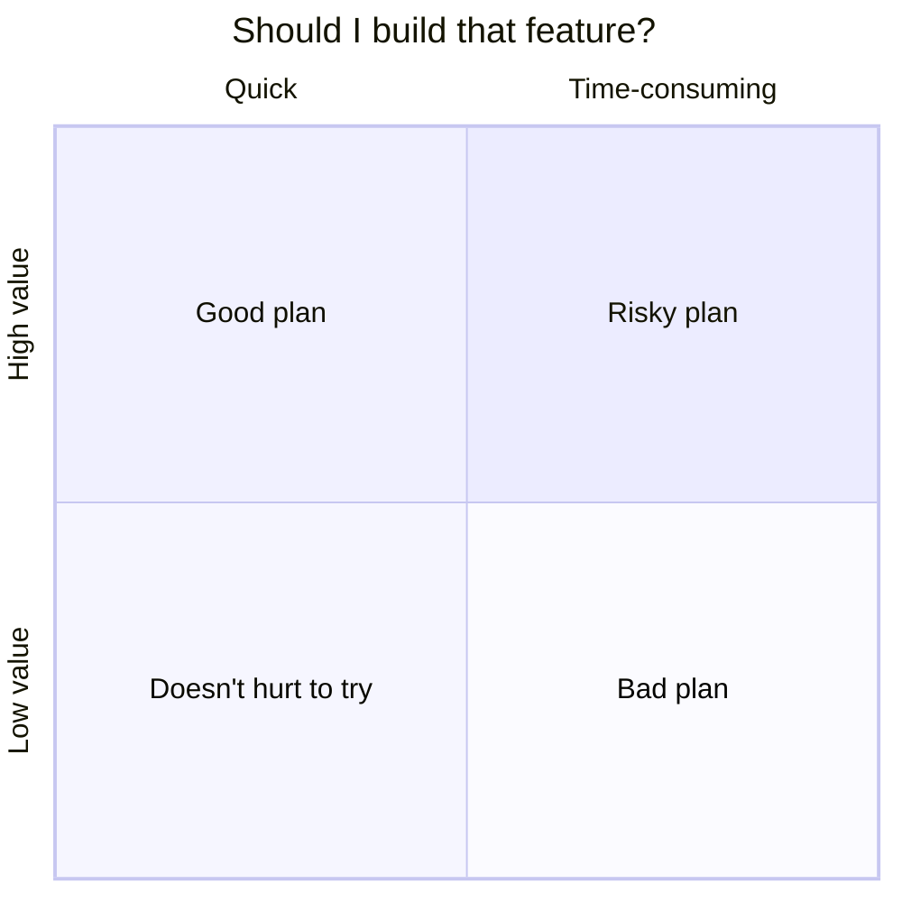
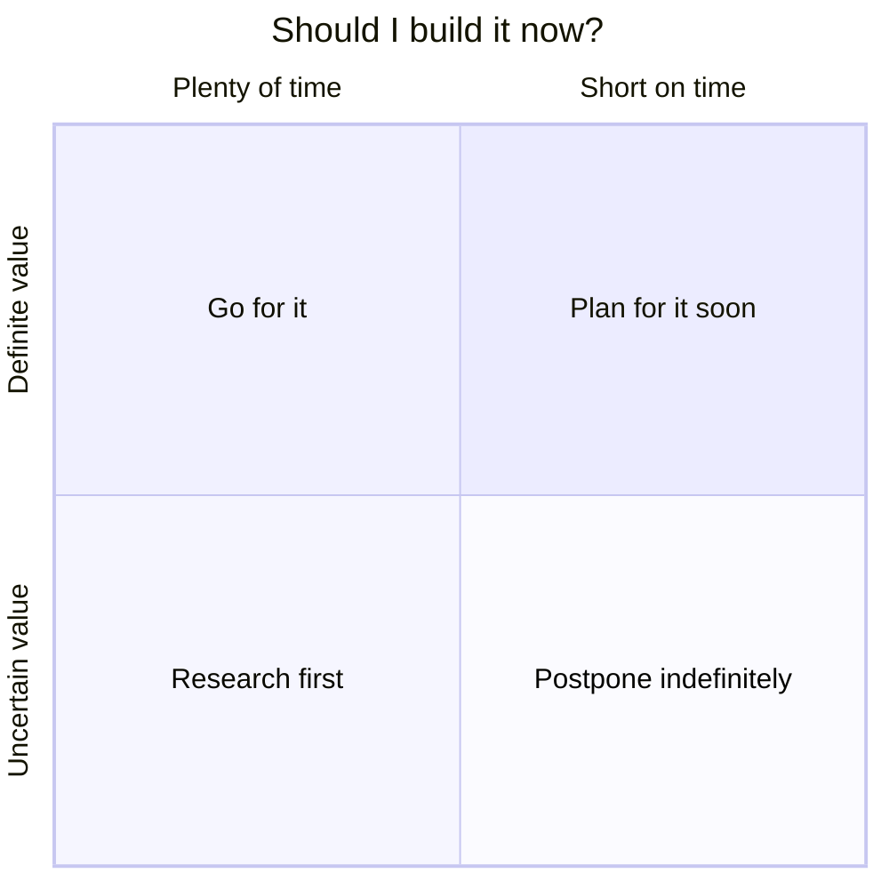
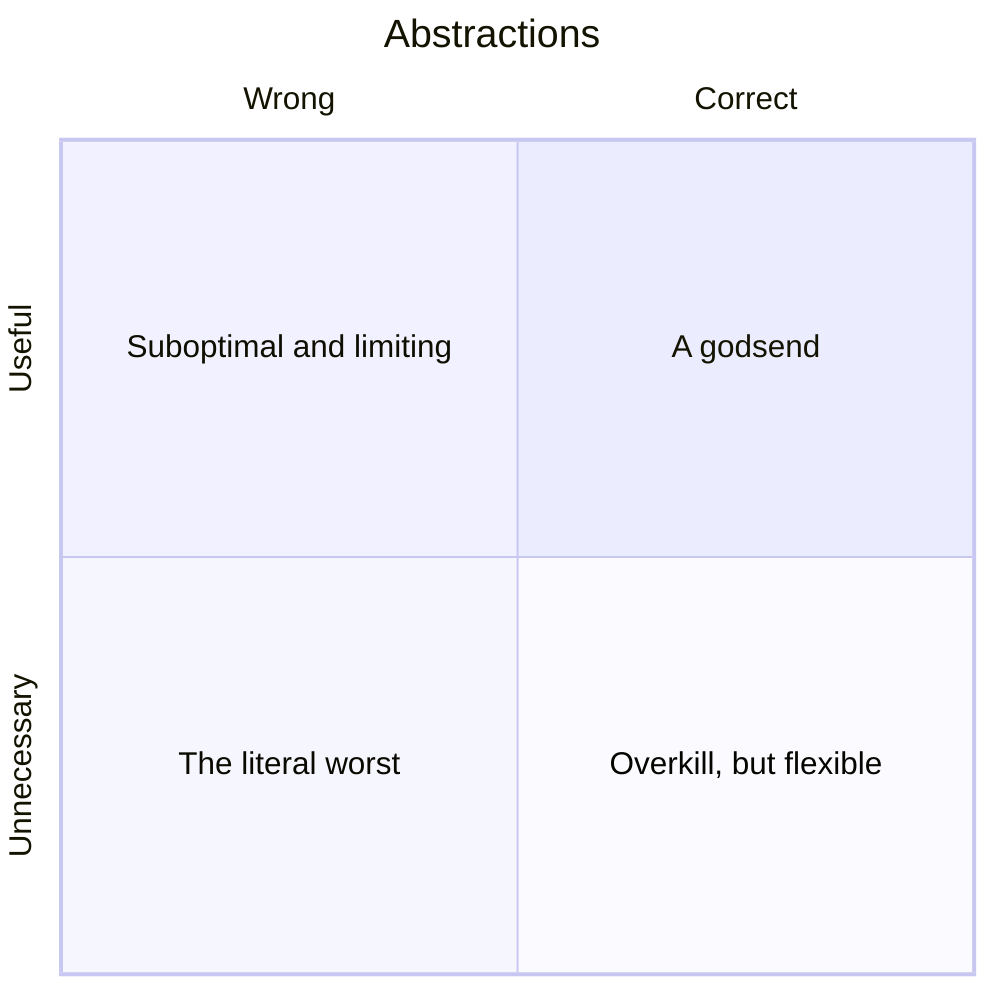
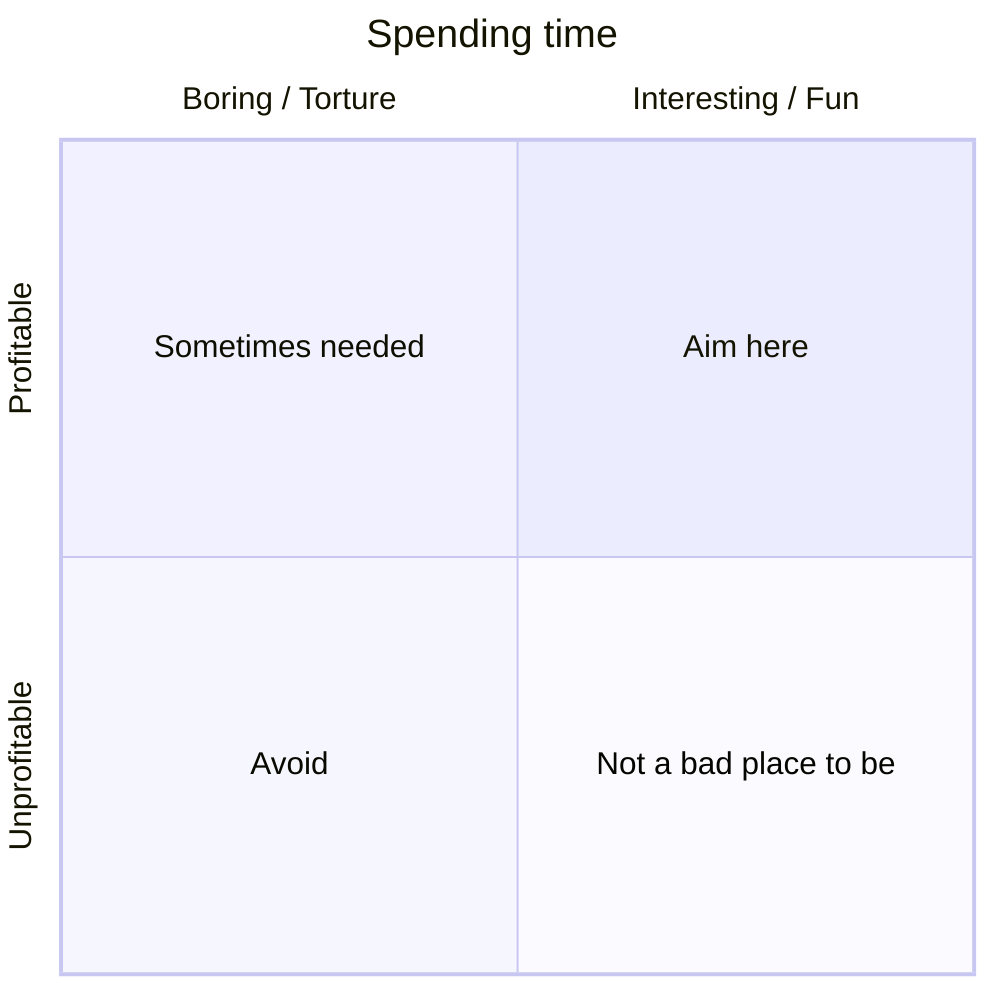

## But first, a tangent
_Feel free to [skip ahead](#coming-back-down-to-earth) if you're more interested in the title._

I often struggle with the choice of whether plan ahead, or just focus on the here and now;  Whether to build more than what's strictly needed.

As a recent example, I wondered if this blog needs a [tag system](/tags).  The immediate questions I had to ask were:
- **How much time** would a tag system cost?  If we're talking minutes, just build it &mdash; better to _have_ the option than _not_ to have it it.  If we're talking days, maybe consider better uses of time.
- **How much value** would a tagging system provide, optimistically?  Will we ever have enough posts to even _need_ a system of organization?

We might think of these kinds of decisions more generally like this:

I also frequently refer to this wonderful xkcd chart: [_Is it Worth the Time?_](https://xkcd.com/1205/)

I've found that, at work, management always wants "quick wins," and not necessarily for bad reason.  They've gone as far as to formally define "team values" that include the following:

> We only build what's needed right now, and never what we _might_ need later.

Maybe it's a good rule of thumb, I take issue with the discussion ending there.  Never building beyond immediate needs can be short-sighted, making your situation worse long-term.  Also, [exploration is valuable in ways that are difficult to predict](https://www.nasa.gov/specials/60counting/tech.html).  And sometimes the path you want to explore falls under the "risky plan" or even "bad plan" quadrants.

We should consider additional aspects to make a better decision:
- **How urgently** do we need to meet our immediate goals?  Is a delay for exploration time we can afford to spend?
- **How certain** is the value of our exploration?  Are we expecting a good return on investment?  Or is it impossible to know?

Closely related to all of this is the decision to generalize a solution to a problem.  Much like premature optimization, premature abstraction can be detrimental to the health of a code base.  Particularly when you choose the _wrong_ abstraction.

We also can't forget that we are humans with finite time on this planet to make the most of.  What is valuable in a business sense is sometimes (often) at odds with living one's best life:

## Coming back down to Earth
Alright, alright, I'm getting a bit carried away with philosophizing and making these nifty quadrant charts.

This post is about **building a level builder**, or starting that process anyway.  I'm doing this because:
- I'm willing to invest the time in a high-value tool
- I have no real deadlines (for now) and have reason to believe the work will pay off
- I care more about doing something interesting and fun than profiting right away

So what should this tool look like?

## TODO
Discuss goals, priorities
