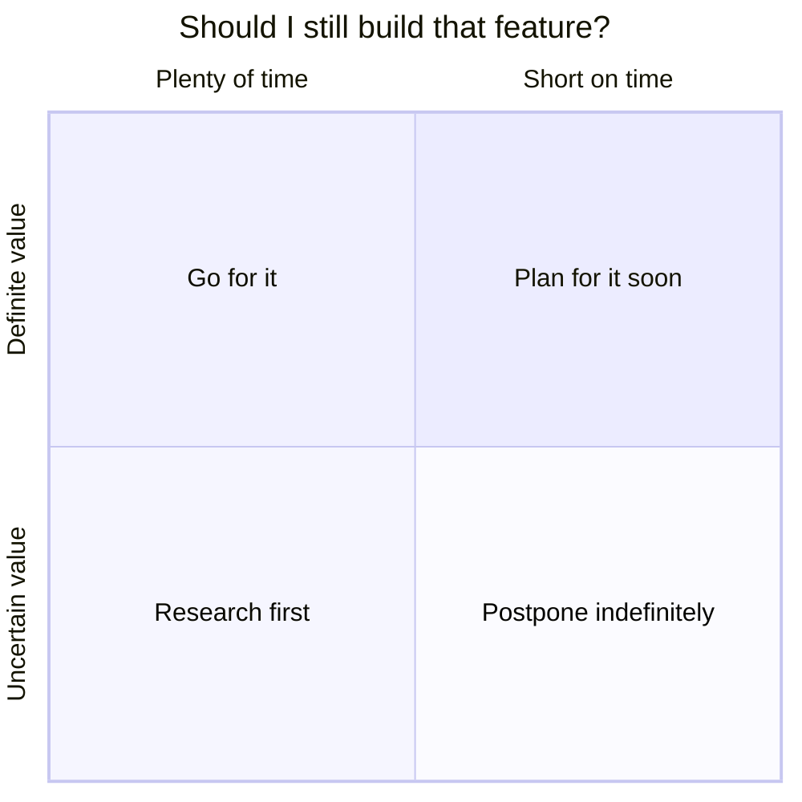
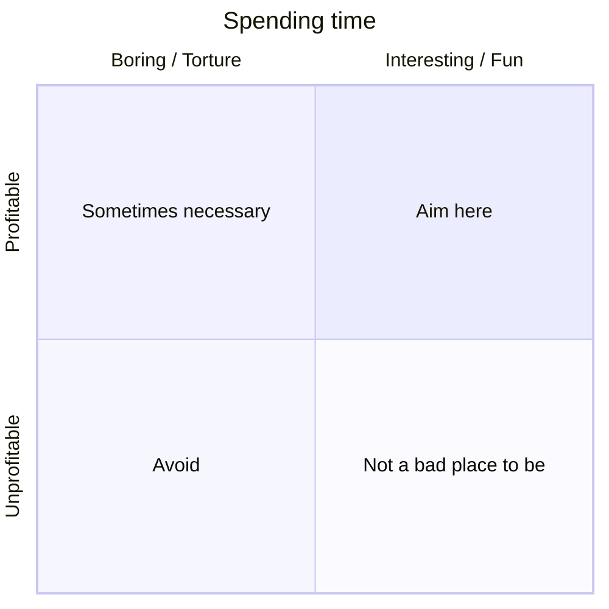

_Feel free to [skip ahead](#continue) if you don't care about "the why."_

When programming, I often struggle to choose between planning ahead, or just focusing on the here and now.  I don't want to over-engineer or abstract prematurely, but I also don't want to be short-sighted.

I've got one of these decisions on my hands right now:

I'm in the early stages of planning a level builder system for a new game.  To be clear, we don't plan to expose this tool to players (at least not yet).  So what we actually need is _levels_, and we while we _could_ build a level builder as a stepping stone, that is not strictly required.

Then it's worth asking whether the level builder will _actually save more time than it will cost to build it._  The following xkcd comics also come to mind:
- [The General Problem](https://www.xkcd.com/974/)
- [Is it Worth the Time?](https://xkcd.com/1205/)
- [Automation](https://xkcd.com/1319/)

Total time spent is not necessarily the only factor to consider though.  We value other things, such as:
- **Flexibility**: it should be easy to change and iterate on level designs
- **Consistency**: levels should feel cohesive (although not too "cookie-cutter")

With that in mind, we might visualize the decision space more like this:

However, "value" can be difficult to quantify and predict.  I don't know for certain how useful this level builder will actually be.  "Time consuming" is also a relative term &mdash; it depends on how urgently you need to meet other goals.  Thus it may also be useful to consider the following:

We also can't forget we humans only have finite time on this planet.  What is valuable in a business sense is sometimes (often) at odds with "living one's best life."  Don't discount what you enjoy just because it isn't profitable.

(I swear this is my last quadrant chart)

Alright, enough philosophizing.

As you probably pieced together from the title, I've decided to pursue a level builder system.  I have reason to believe it will be valuable, I am in no rush, and I think it will be interesting.

## Inspiration
I'm quite intrigued by [Oskar Stålberg](https://x.com/OskSta)'s approach to procedural content generation.  If you're not familiar, he's the creator of [Townscaper](https://store.steampowered.com/app/1291340/Townscaper/), a small sandbox game in which you create cute island towns.  Here's a small taste:

<blockquote class="twitter-tweet" data-media-max-width="560" data-dnt="true">
I needed some more greenery, so now if you build an enclosed area it becomes a backyard! <a href="https://t.co/IOjFOPqKZv">pic.twitter.com/IOjFOPqKZv</a>
&mdash; Oskar Stålberg (@OskSta) <a href="https://twitter.com/OskSta/status/1238474550511308800?ref_src=twsrc%5Etfw">March 13, 2020</a></blockquote>  

The game does several things quite well.  The first is that it's incredibly easy to be productive.  Aside from customizing the colors of your buildings, all you do is left click on building faces to extend them, and right click to shrink/delete them.  That's it.

Behind the scenes, there's an algorithm that decides whether the blocks you place require stairs to navigate, what angles the roofs should be, whether a segment requires extra structural support, where doors and windows should be, etc.  There's no need to bother the player with these details.

The other thing it does very well is producing towns that look organic and hand-crafted.  The game does not use a evenly-tiling grid, which forces the geometry to stretch and distort in ways that it wouldn't have to if it were on a regular rectangular or hexagonal grid.  This alone does a lot of heavy lifting, but the randomized decorative elements also go a long way.

## What we want for our level builder
I'm not sure how closely we want to replicate Townscaper's approach, but it's a good reference point.

TODO
