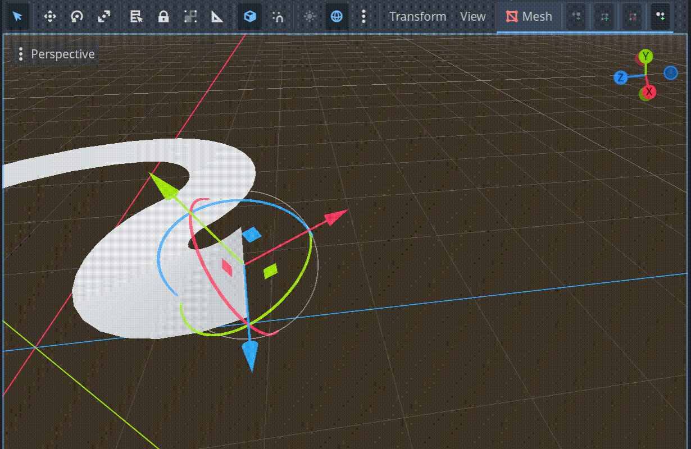
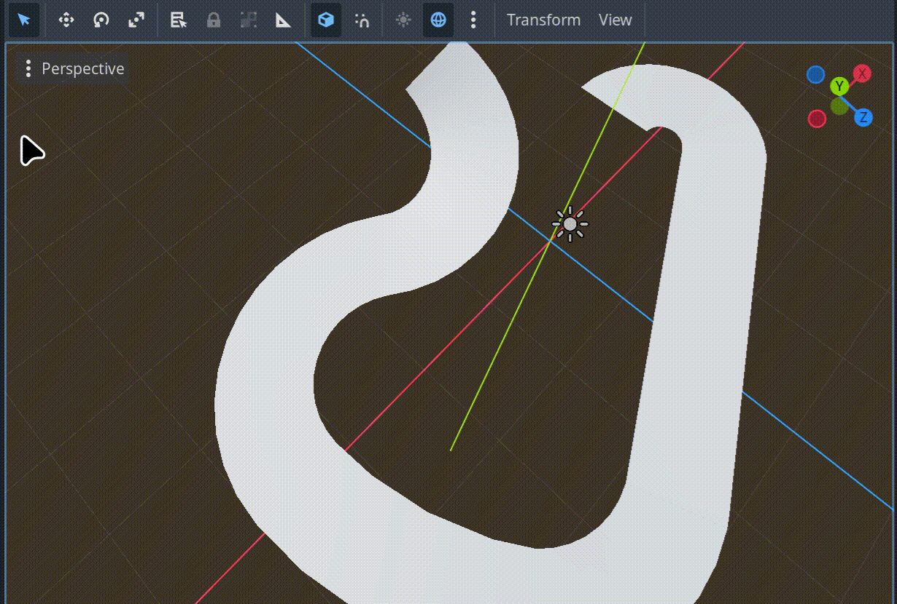
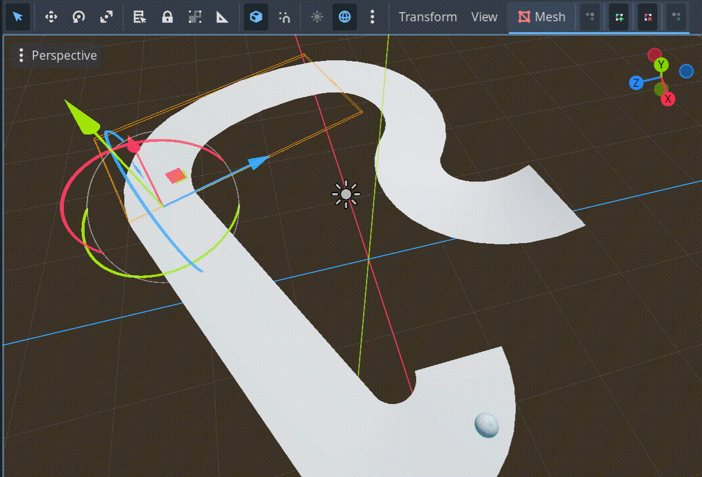
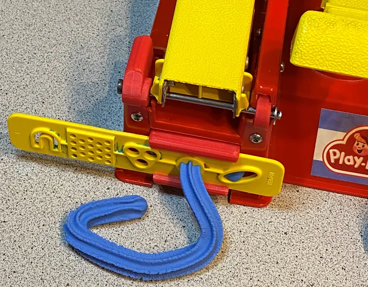
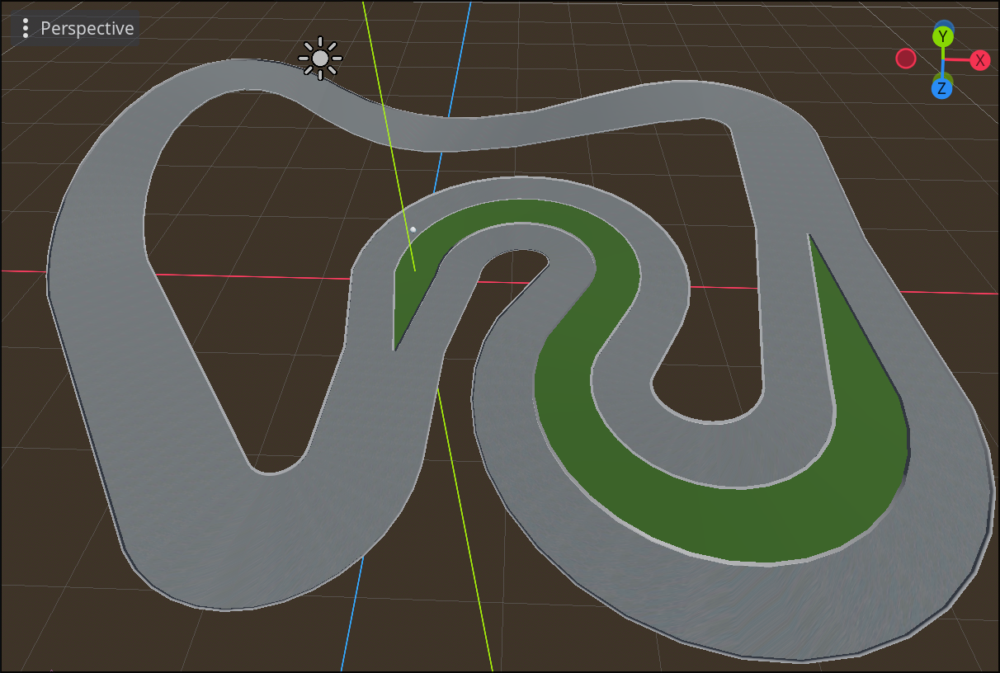
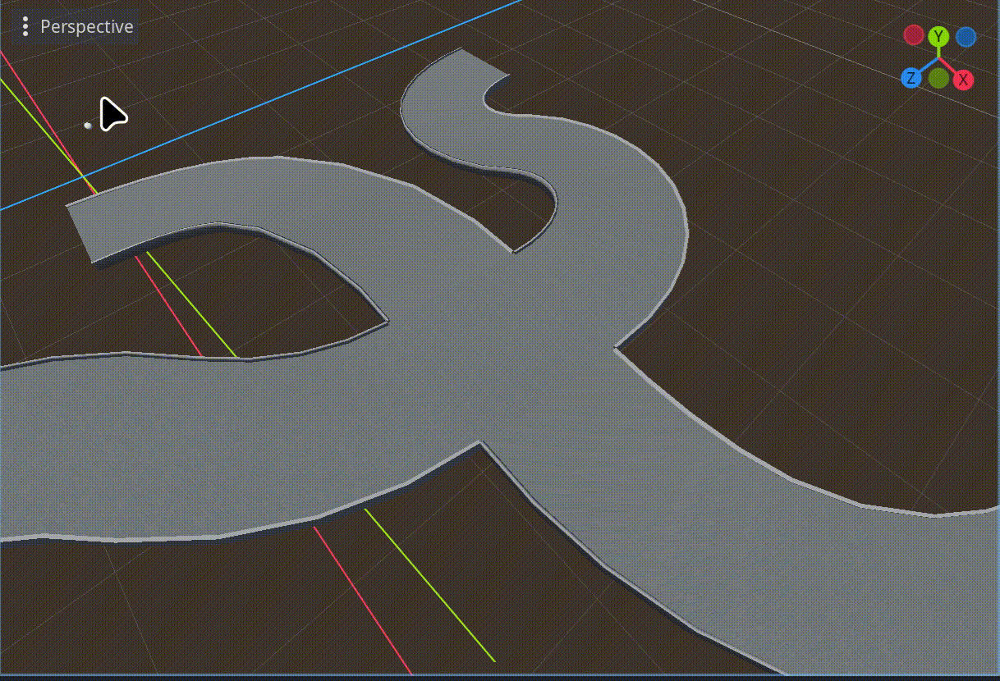
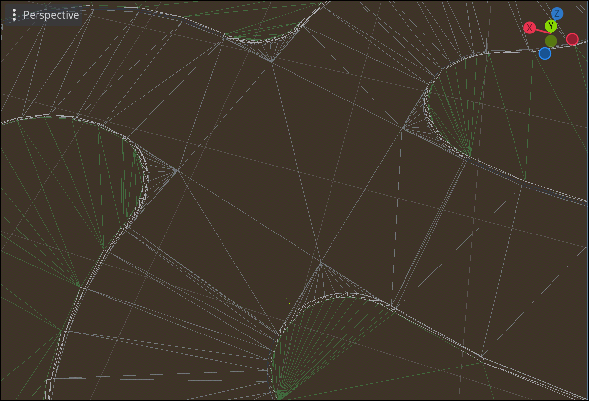
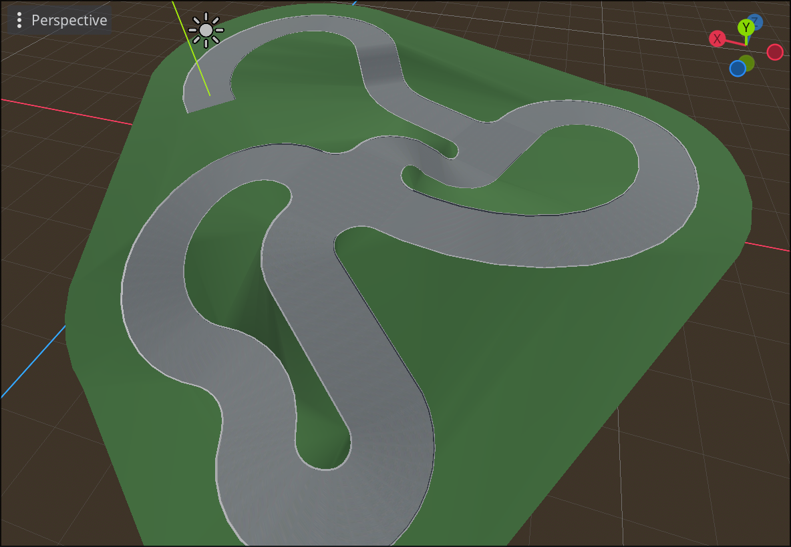
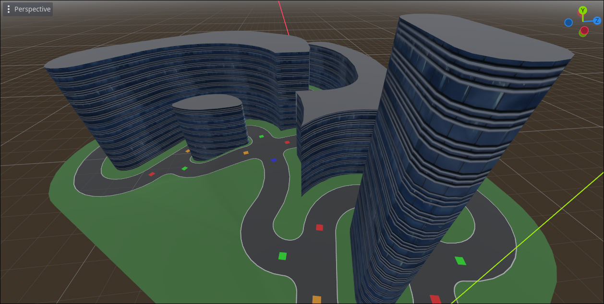

In the [last post](../building-a-level-builder/), I described our aspirations for our next game's level builder, promising an update in the following "weeks or months."  Well today I'm back, and... wait, what _year_ is it?!

A lot has changed over the last 17 months!  The game is now officially called [Delivery Derby](https://store.steampowered.com/app/4615650/Delivery_Derby/?snr=1_5_1100__1100&utm_source=fps-website) (wishlist on Steam 🙏), we've significantly fleshed out the gameplay and design, got some music tracks [professionally produced](https://www.matteopalmermusic.com/), showed a demo at [2D Con 2026](https://www.2dcon.net/indie-games/indie-island/), and have professional game art in the works.

But more on all that some other time.  Today, I just want to share the progress I've made on level editor tooling.  It has been quite a journey!

## From humble beginnings
Before attempting to hand-roll everything, I briefly explored Godot's builtin `Path3D` as the basis for road shapes, but it quickly became apparent that Bézier curves have too many degrees of freedom.  I just wanted to place a few nodes and have a logical, smooth road automatically connect the dots.  After some experimentation, I landed on this approach:

<video width="640" height="360" autoplay loop muted playsinline>
  <source src="poc.mp4" type="video/mp4">
  Your browser does not support the video tag
</video>

These curves are a combination of [biarcs](https://www.ryanjuckett.com/biarc-interpolation/) and [Dubins paths](https://en.wikipedia.org/wiki/Dubins_path), which both have desirable properties but neither is usable on their own:
- **Biarcs** have a smooth, pleasing shape most of the time.  But they do not respect a minimum turn radius, and under certain conditions generate paths that are WAY too long (see interactive demo in biarcs link above).
- **Dubins paths** respect a minimum turn radius and guarantee an optimal path.  However, the shortest possible path is not always the smoothest or best looking.

The simple solution was to generate a biarc by default, but if it turns too sharply or is too long, fallback to Dubins.  You can see this fallback behavior in the video above.

## Improving editor support
Happy with the proof of concept, it was time to make the tool more usable.  Wiring up nodes by hand seemed too tedious for rapid level prototyping, so I added some editor buttons to speed up common operations:

### Append
Create a new node a few meters away from your selection, and wire up the connection.

### Insert
Given an existing connection `A → B`, insert a new node `C`, disconnecting `A` and `B` and wiring up `A → C → B`.

### Dissolve
Opposite of insert.  Given a connection `A → B → C`, remove node `B` and reconnect `A → C`.

## Better road geometry
Next it was time to move beyond flat road surfaces.  My plan was to generate geometry using 2D profiles that extend along the curves shown above, much like a play-doh extruder:

However, a road's profile can change over its length, such as when lanes or center dividers are added/removed.  Smoothly transitioning between different road profiles would be a challenge.  This was my first attempt with limited transition support (note the awkward center divider transitions):

I would improve upon this later, but first we sorely needed intersections to have a functioning road system.  Intersections don't fit the "play-doh extruder" mental model, which made them a bit harder to implement.  As a first pass, I just ignored the corner geometry:

It took much longer to make smooth intersection corners, but the effort was worth it.  Here's the wireframe view, which I thought was quite satisfying:

## Terrain and building experiments
You may have noticed green lines in that last screenshot.  That's because as I was wrapping up intersections, I was already moving on to procedural terrain.

Our grand vision was to have terrain be defined implicitly, _entirely in terms of the roads_.  The rationale was that our game takes place entirely on roads, so manually designing terrain would be a waste of time.  Howver, making auto-generated terrain look good turned out to be extaordinarily difficult, eventually leading us to postpone the auto-terrain feature indefinitely.

That said, a lot of interesting work was done here, and we may need to revisit if we want an in-game level editor in the future.  Here was an early prototype:

At this stage, there was no terrain smoothing.  We simply traced the edges of the road network to form rings, then used an off-the-shelf library to triangulate the rings into polygons.

This ring tracing code also ended up being useful for quickly generating buildings that fill the space between roads.  This was ultimately scrapped as well, but we did get some use out of it for a couple playtest sessions.

## Refining roads
- https://github.com/Frozen-Pizza-Studios/delivery-derby-godot/pull/24
- https://github.com/Frozen-Pizza-Studios/delivery-derby-godot/pull/28
- https://github.com/Frozen-Pizza-Studios/delivery-derby-godot/pull/30
- https://github.com/Frozen-Pizza-Studios/delivery-derby-godot/pull/56

## Attempted terrain refinements
- https://github.com/Frozen-Pizza-Studios/delivery-derby-godot/pull/38 (discord has gifs)
- https://github.com/Frozen-Pizza-Studios/delivery-derby-godot/pull/40
- https://github.com/Frozen-Pizza-Studios/delivery-derby-godot/pull/55

## Traffic system
- https://github.com/Frozen-Pizza-Studios/delivery-derby-godot/pull/61
- https://github.com/Frozen-Pizza-Studios/delivery-derby-godot/pull/65
- https://github.com/Frozen-Pizza-Studios/delivery-derby-godot/pull/68 (find or make gifs for this)
